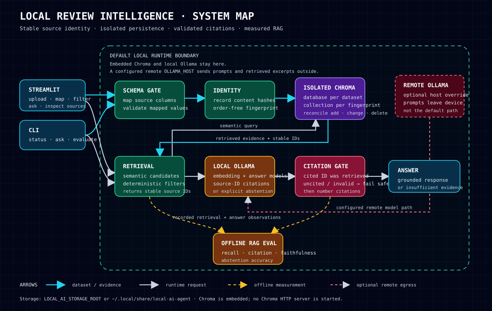

# Architecture



## Boundaries

The dashboard and CLI are clients of the same ingestion, analytics, retrieval, answer, and evaluation services. Streamlit does not own indexing logic.

Runtime review data crosses these boundaries:

1. **Schema gate:** maps source columns into the canonical review schema and rejects invalid mapped values.
2. **Identity layer:** hashes normalized record content and creates an order-independent dataset fingerprint.
3. **Storage layer:** derives a separate Chroma database directory and collection from the dataset fingerprint. Re-indexing reconciles additions, changed records, and deletions.
4. **Retrieval layer:** performs semantic search, then applies deterministic rating, date, sentiment, restaurant, and country filters.
5. **Answer layer:** supplies numbered evidence records and their stable source IDs to Ollama. An answer is returned only when every bracketed evidence number maps to a retrieved record. Exact source-ID citations remain accepted for backward compatibility; validated references are rendered as reader-facing citation numbers.
6. **Evaluation layer:** runs the curated cases in `local_ai_agent/data/rag_cases.json` and reports retrieval recall, citation correctness, reference-grounded answer faithfulness, and abstention accuracy.

## Storage identity

A review ID is derived from its normalized canonical fields and retained extra metadata. Duplicate identical records receive deterministic occurrence suffixes. Row order is not part of identity.

The dataset fingerprint is the SHA-256 digest of the sorted record digests. Therefore:

- reordering rows reuses the same dataset storage;
- editing review content creates a new record identity;
- removing a review deletes its stale vector during reconciliation;
- different datasets receive different persistence directories and collections automatically.

The default storage root is:

```text
~/.local/share/local-ai-agent
```

Set `LOCAL_AI_STORAGE_ROOT` to override it.

## Privacy model

Ollama and Chroma are local by default. Chroma is embedded in the Python process; this application does not start Chroma's HTTP server.

`OLLAMA_HOST` is configurable. If it points to another computer or hosted endpoint, prompts and retrieved review excerpts are sent to that endpoint. Dependency installation, model downloads, and any user-configured remote services may also use the network. The application does not provide authentication or multi-user isolation, so it should not be exposed directly as a shared public service.

## Evaluation scope

The faithfulness metric is a transparent reference-grounded check over expected answer terms and cited source text. It is useful for regression tracking, but it is not a substitute for expert review or a semantic judge. Run the measured suite against the configured local models with:

```bash
local-ai-agent evaluate
```
